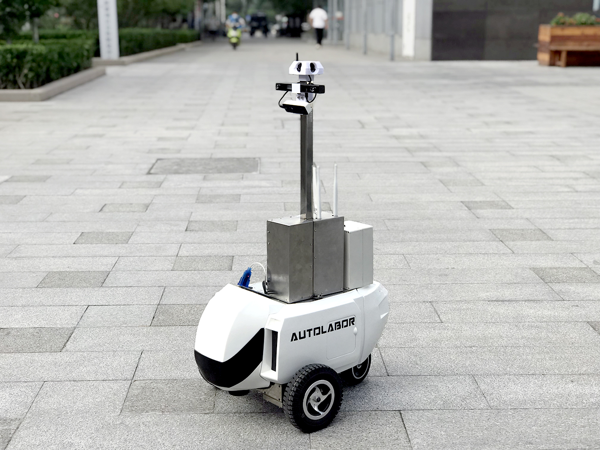
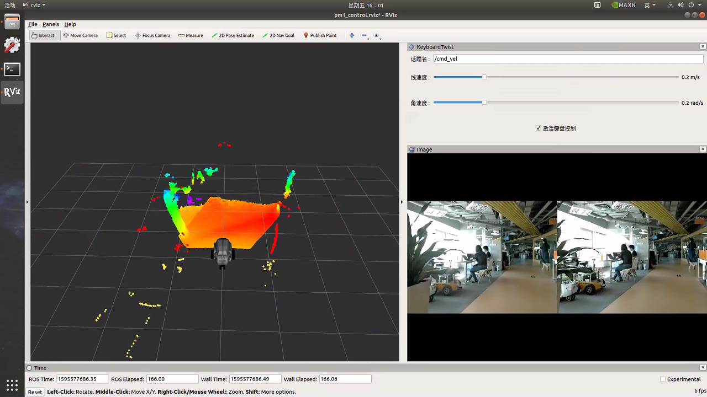
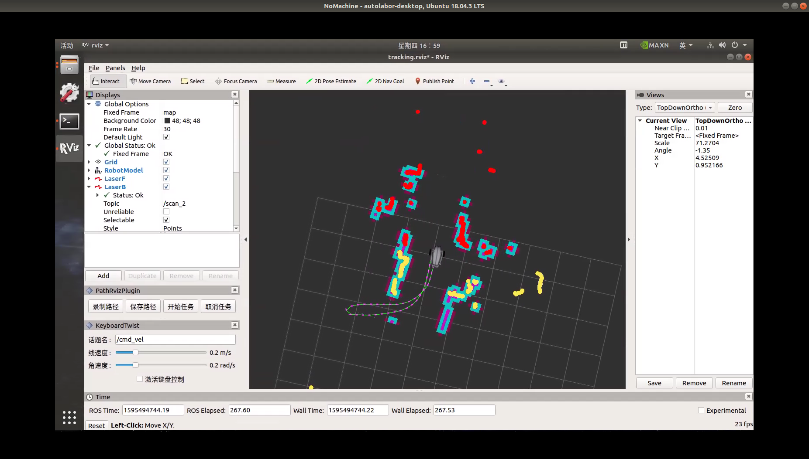
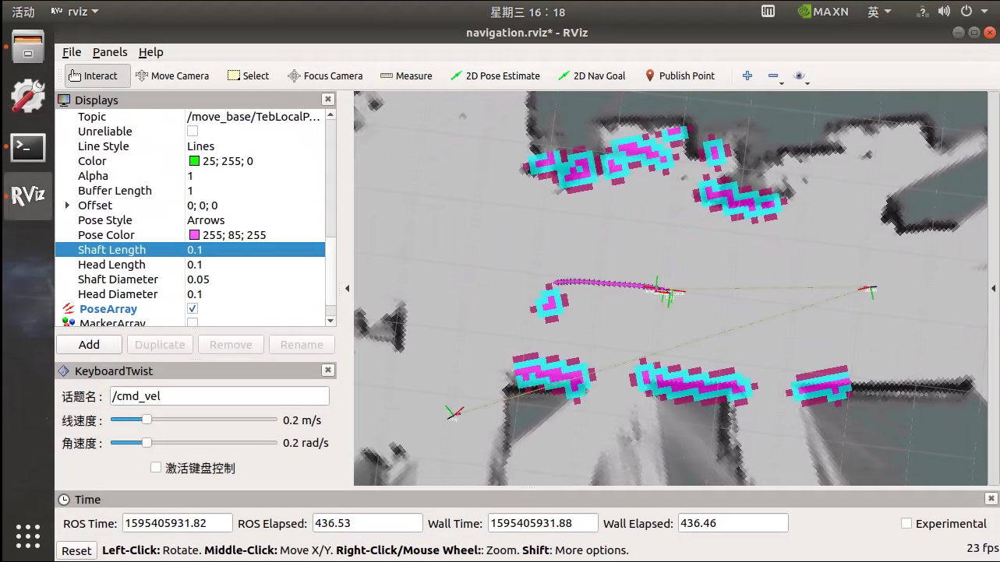

# 产品简介

## Autolabor PM1 导航机器人

支持 **4G/5G/Wifi 远程遥控**，实时图像传输，可**指定路线巡迹**，适用于小区、厂房、机房巡逻等场景。 

机器人底盘负载 80KG，主控单元预留接口，可扩展安装GPS、惯导、超声波等传感器，云台、机械臂、抓持器等设备。

支持 ROS，一键式导航操作，极大降低了使用门槛，代码全部开源，软件持续更新，丰富的资料，可帮助使用者快速开始应用开发。

## 产品功能

## 远程遥控

## 定点巡迹

## SLAM 导航

