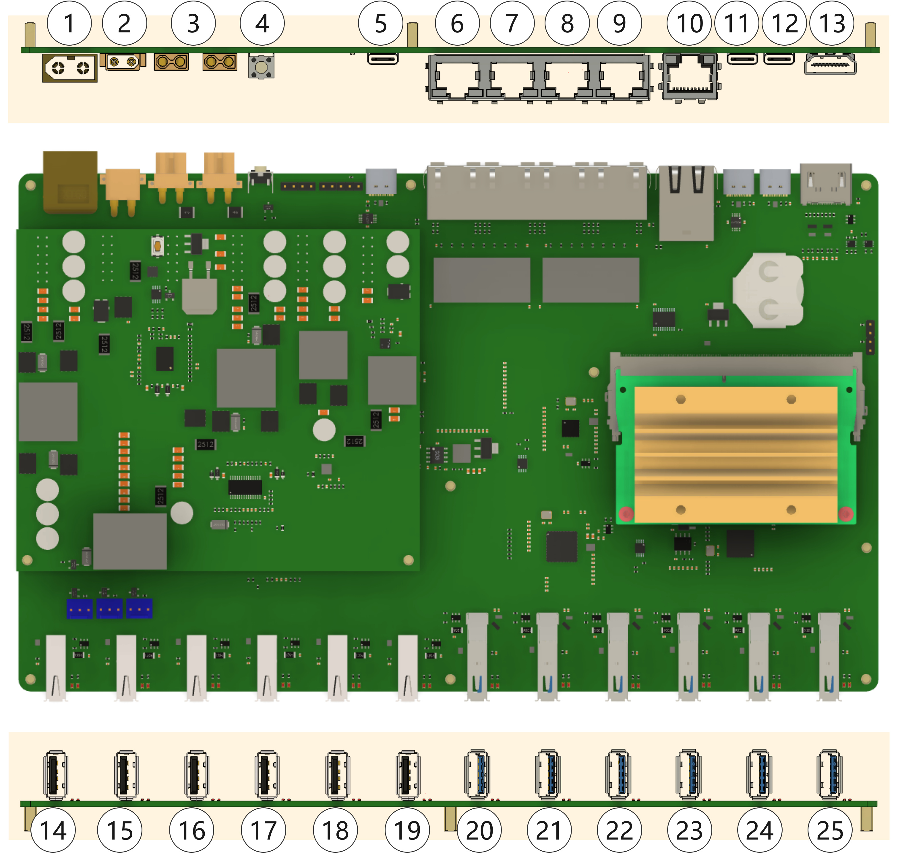
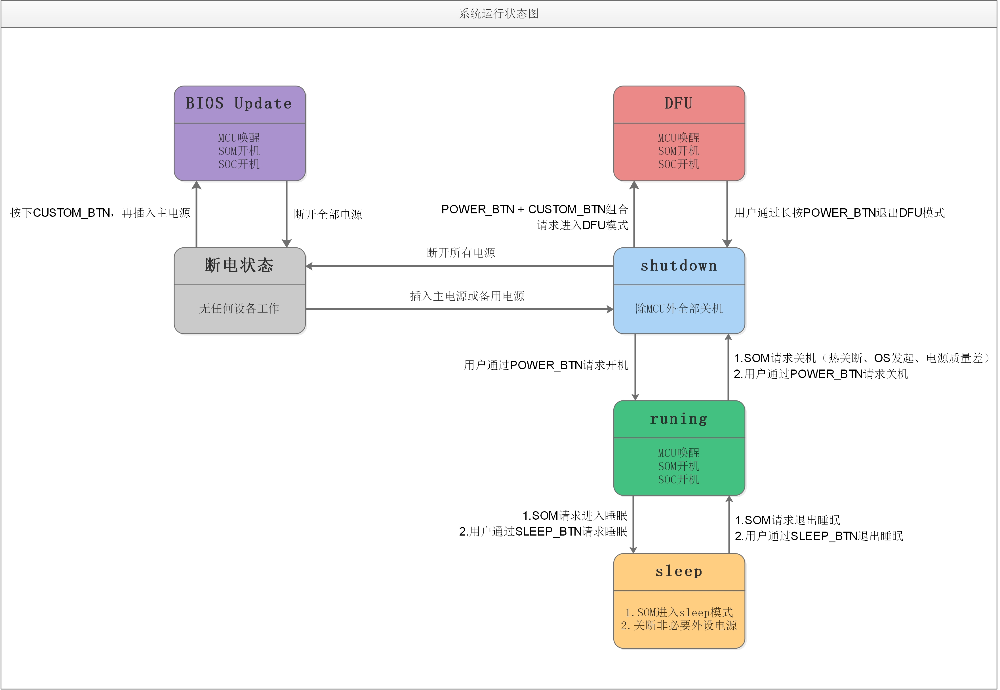

# 主板功能简介

* 1 : 主电源输入，19V-29V
* 2 : 备用电池，12V(标称)铅酸蓄电池
* 3 : 12V电源输出
* 4 : 自定义按键
* 5 : BIOS升级接口
* 6 : LAN0 默认100Mbps + 24V PoE; 可选:1Gbps, 无PoE
* 7 - 9 : LAN1 - LAN3, 1Gbps
* 10 : WAN, 1Gbps
* 11 : CPU debug 
* 12 : SOM DFU
* 13 : HDMI 输出
* 14 - 19 : USB2517, #1 - #6
* 20 - 21 : RTS5411, #2 - #3
* 22 - 25 : VL805, #1 - #4

# 电源模式状态机

## 开机

1. 关机状态下，长按`电源`按钮；
2. 听到滴声后，松开按钮;
3. 开机后电源灯为`常亮`状态

## 关机

1. 开机/DFU状态下，长按`电源`按钮；
2. 听到滴声后，松开按钮;
3. 关机后电源灯为`熄灭`状态

## DFU

> Device Firmware Update , 针对Jetson Nano的固件升级模式

 * 进入方法：
    1. 关机状态；
    2. 按下`重启`按钮；
    3. 按下`电源`按钮；
    4. 听到`3次滴声`后，松开两个按钮。（电源灯表示为闪烁状态）
    5. 检查Host PC是否有一个名为`Nvidia Crop.`的设备

## BIOS升级

> 针对主板的基础功能控制器的固件升级

* 固件及升级工具： https://github.com/autolaborcenter/EmbeddedProductData

* 进入方法：
   1. 断开主板的主电源和备用电源，并将主板BIOS的USB typeC接口和Host PC连接；
   3. 按下`重启`按钮，插入主板的主电源，听到`5次滴声`后，松开`重启`按钮；
   4. 打开STM32CubeProgrammer，选择UART模式，点击Connect；
   5. 点击Open，选择新固件，点击Download

   # 