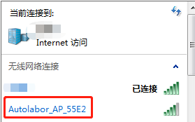
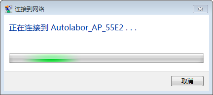
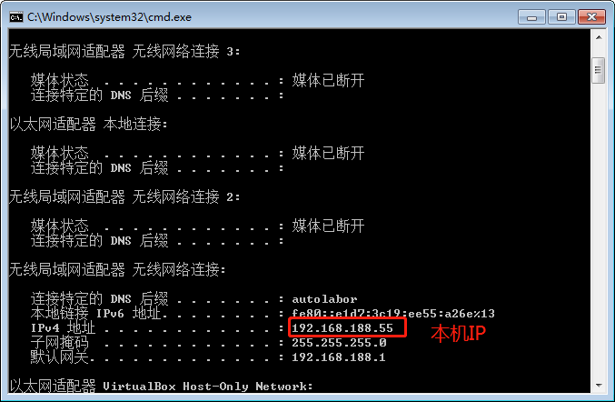

# 连接设备

## 内网连接

步骤：

1. 连接内网
2. 获得远程连接地址
3. 连接设备

### 一、连接内网

1. 机器人电源打开后，打开用户端 WiFi 连接，能够看到名为 `Autolabor_AP_xxxx` 的 WiFi（xxxx为产品随机id）。
    
2. 连接该 WiFi，密码 `autolabor`。首次连接网络时会有些慢，请耐心等待连接完成。
    
3. 连接完成

    

    用户端主机 IP 可在系统 terminal 中执行 `ipconfig`（windows) 或 `ifconfig` (linux) 查看本机 IP 是否为 `192.168.188.xx`，如是则连接成功。

    以 windows  为例：

        

    网络连接完成后，下一步进行设备连接。

### 二、获得远程连接地址

根据远程操作界面的不同，PM1 导航套件提供 远程桌面软件 或 远程命令访问/SSH 两种方式。

内网远程桌面访问地址： 192.168.188.1 端口：4000

内网 SSH 访问地址：192.168.188.1  端口:22

用户名：autolabor

密码：autolabor

推荐用户使用 `远程桌面`，有图形化界面操作更方便，还可直接与用户端主机传输文件。

### 三、连接设备

#### 远程桌面

远程桌面使用的是 NoMachine，这是一个多平台的远程桌面访问工具，图形化操作界面，支持 Windows/Mac/Linux，同一时间仅限 1 人连接（可理解为teamviewer）。

#### 下载

[NoMachine](https://www.nomachine.com/download)

#### 安装

####　启动

1. 打开 NoMachine 软件，会弹出引导页面，点击 `continue`

2. NoMachine 会将同一局域网中所有设备的列出，与机器人在同一网络时，可直接看到机器人设备，右键点击设置图标，选择 `Edit Connection` 按钮。

默认IP 为 `192.168.188.1`，端口为4000。如设置中设备与下图不符，请对应修改，否则则无法连接。

3. 点击 `OK` `continue`，开始连接

4. 输入  用户名： autolabor 密码： autolabor

5. 点击 `OK`，成功连接到机器人上。
    
    此时桌面上弹出了一个对话框，是远程桌面软件的设置窗口，左下角勾选之后会不再显示，点击 `OK` 关闭。

    注：如果连接的时候显示白屏，此时系统图形化界面加载中，请等待片刻。

    

***

#### SSH

此处用 windows 下的 putty 介绍，SSH 的连接方式。

1. 打开 putty 软件，Host: `192.168.188.1` Port: `22`，`open` 打开。

2. 选择 `是`

3. 输入 用户名：autolabor 密码：autolabor，回车连接

4. 登录成功

