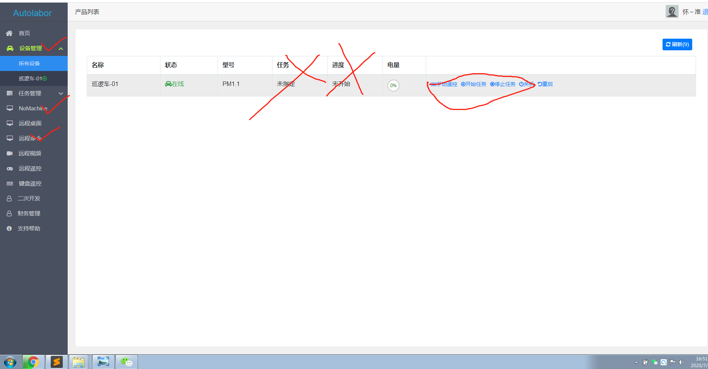
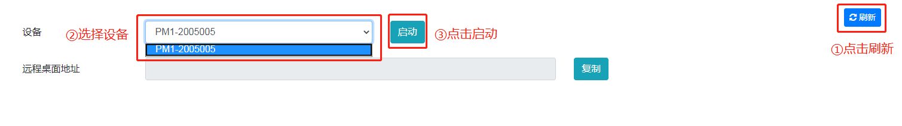
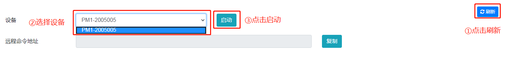

# 连接设备

## 配置网络

此步骤的目的是：

1. 选择远程连接方式
2. 得到机器人端的远程访问地址

***

### 远程连接说明

PM1 导航套件提供 `内网` 与 `外网`两种方式进行远程连接。

内网要求：

* 用户端主机必须有网卡
* 用户端主机与机器人的距离不能超过无线局域网的有效范围，距离过远或遮挡都会影响连接

外网要求：

* 用户端主机必须能够上外网
* 如机器人所在地无 4G/5G 信号覆盖，则无法进行远程连接

***

### 方法一、选择内网

1. 机器人电源打开后，打开用户端 WiFi 连接，能够看到名为 `Autolabor_AP_xxxx` 的 WiFi（xxxx为产品随机id）。
    
2. 连接该 WiFi，密码 `autolabor`。首次连接网络时会有些慢，请耐心等待连接完成。
    
3. 连接完成

    

    用户端主机 IP 可在系统 terminal 中执行 `ipconfig`（windows) 或 `ifconfig` (linux) 查看本机 IP 是否为 `192.168.188.xx`，如是则连接成功。

    以 windows  为例：

        

    内网机器人远程连接地址为：`192.168.188.1`

    网络连接完成后，下一步进行[设备连接](/userdoc/user_guide/network/connect)。

***

### 方法二、选择外网

注：如使用外网远程连接，则每次连接前都需要**重新获取**远程访问地址。

1. 使用微信扫描随车附上的 `云服务管理员-绑定二维码`，扫描后该微信用户与产品绑定成功。 **此二维码只能使用一次，绑定成功后失效，用户无法自行解绑，请谨慎操作**。
2. 访问 `cloud.autolabor.com.cn`，使用微信扫码登录，进入云服务管理界面。

    

3. 在设备管理中，可以看到该微信用户名下绑定的所有设备。

    
 
4. 左侧管理菜单中，有 `远程桌面` 与 `远程命令` 两个菜单栏，分别对应的是获取机器人  图形化界面 与 SSH 的远程连接地址 。
        
    推荐用户使用 `远程桌面`，有图形化界面操作更方便，还可直接与用户端主机传输文件。

    **方法一：`远程桌面`**

    点击进入 `远程桌面`页面：
    
    ① 点击右上角的`刷新`按钮，刷新设备状态
    ② 选择对应的设备
    ③ 点击`启动`

    

    启动后得到 `远程桌面地址` : cloud.autolabor.com.cn:40010

    请记住该地址，之后连接会用到。

    

    **方法二：`远程命令`**

    点击进入 `远程命令`页面：

    ① 点击右上角的`刷新`按钮，刷新设备状态
    ② 选择对应的设备
    ③ 点击`启动`

    
    

    启动后得到 `远程命令地址` ： ssh -p 40008 cloud.autolabor.com.cn

    

    请记住该地址，之后连接会用到。

5. 得到远程访问地址，下一步进行[设备连接](/userdoc/user_guide/network/connect)。

