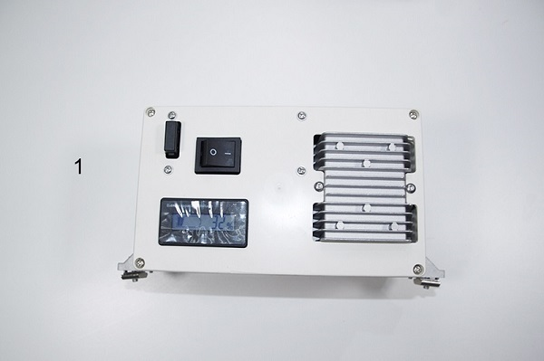
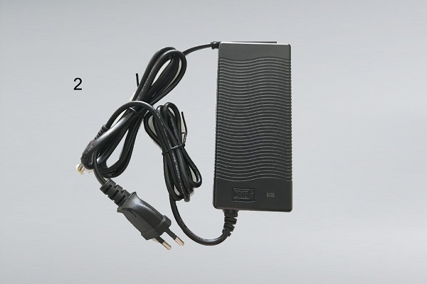
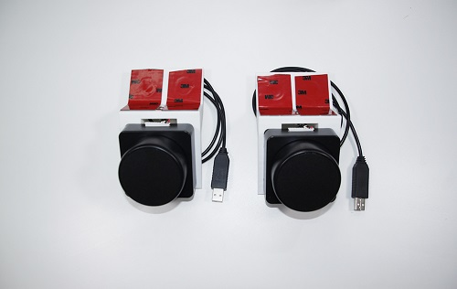

# 收货指南

## 检查

收到货后请不要急于签收，先检查外包装<b style="color:red;">有无破损</b>，如包装破损或贴于外包装上的防震标签感应器显示为红色，请拍照为证，并与快递员一同开箱验货，<b style="color:red;">确认无误</b>后再签收，如需帮助可联系 Autolabor 客户服务平台。

# 清点

温馨提示：

* 收件后打开包装，对照产品装箱单进行清点，如有短缺请于<u>三日内</u>联系客服，<u>过期不补</u>。
* <b style="color:red;">请保留原厂外包装箱用于售后</b>。
* 部分配件可能随版本升级有所改动，但不影响性能，恕不另行通知。

***

## 主控单元

## 电源模块

| 序号 | 名称       | 数量 |
| ---- | ---------- | ---- |
| 1    | 电源模块       | 1    |
| 2    | 电源模块充电器 | 1    |

## AP 天线

| 名称     | 数量 |
| -------- | ---- |
| AP 天线  | 2   |

## 摄像头

| 序号 | 名称       | 数量 |
| ---- | ---------- | ---- |
| 1    |  双目摄像头       | 1    |
| 2    |  数据线       | 1    |

## 深度相机

| 序号 | 名称       | 数量 |
| ---- | ---------- | ---- |
| 1    | PicoZense DCAM710       | 1    |
| 2    |  数据线       | 1    |

## 激光雷达

| 名称     | 数量 |
| -------- | ---- |
| 激光雷达 | 2   |

## 定位系统

| 序号 | 名称 | 数量 |
| ---- |---- | ---- |
|  1 |车载定位标签支架        | 1    |
|  2 |车载定位标签组件        | 1    |
|  3 |车载定位标签支架角码    | 3    |
|  4 |定位标签                | 11   |
|  5 |定位路由               | 1   |
|  6 | 定位标签胶条                | 11    |

## 其他

| 序号 | 名称                    | 数量 |
| ---- | ----------------------- | ---- |
| 1    | xxx | 1    |
| 2    | 内六角扳手              | 2    |
| 3    | M5x16螺钉               | 2    |
| 4    | 2020角码                | 2    |
| 5    | M5大滑块                | 2    |
| 6    | M5小滑块                | 2    |
| 7    | M5x12螺钉               | 2    |
| 8    | 十字改锥                | 1    |

