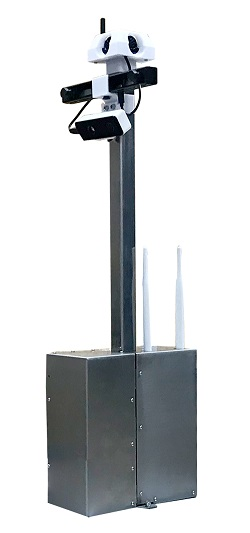
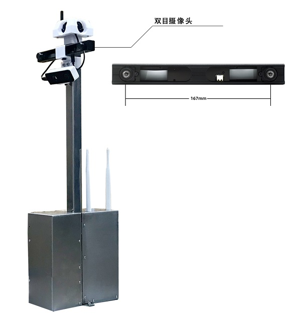
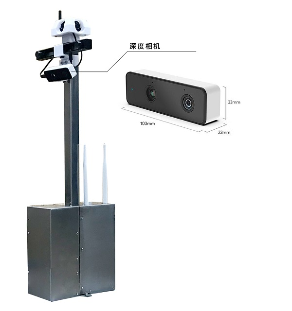
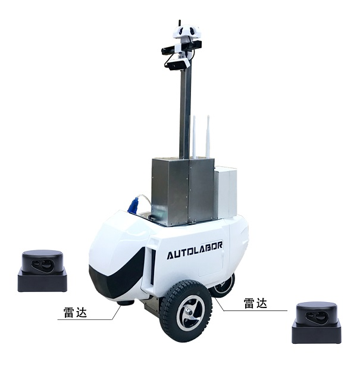
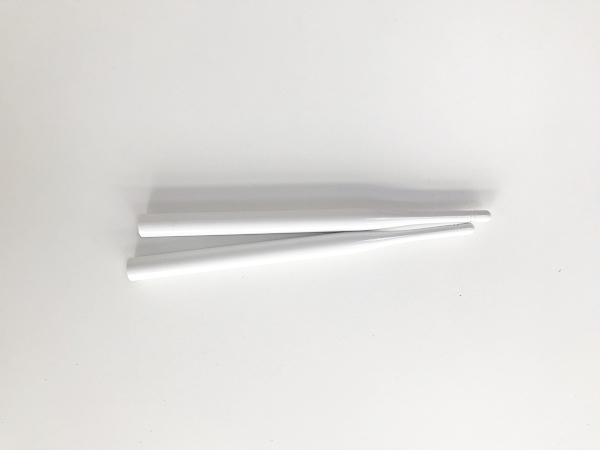
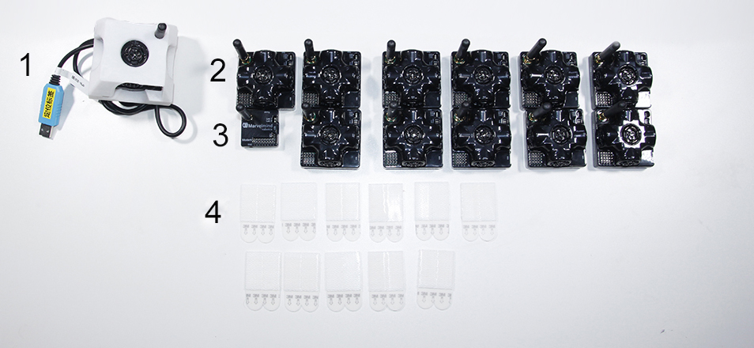
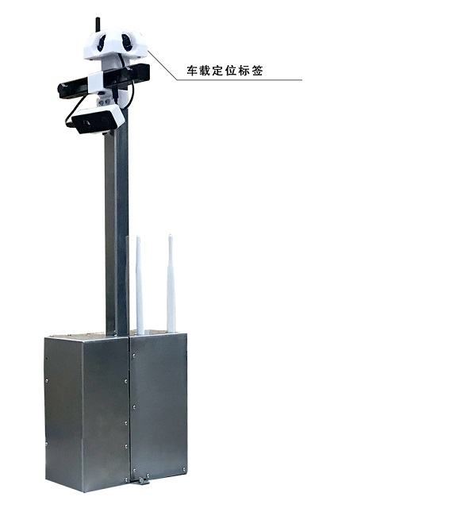

# 收货指南

## 发货清单

Autolabor PM1 机器人 发货共计 3 箱

| 序号 | 名称     | 数量 |
| -------- |  -------- | ---- |
| 1 | Autolabor PM1 底盘  | 1   |
| 2 | Autolabor PM1 导航套件  | 1   |
| 3 | Autolabor PM1 定位系统  | 1   |

## 检查

收到货后请不要急于签收，先检查外包装<b style="color:red;">有无破损</b>，如包装破损或贴于外包装上的防震标签感应器显示为红色，请拍照为证，并与快递员一同开箱验货，<b style="color:red;">确认无误</b>后再签收，如需帮助可联系 Autolabor 客户服务平台。

## 清点

温馨提示：

* 收件后打开包装，对照产品装箱单进行清点，如有短缺请于<u>三日内</u>联系客服，<u>过期不补</u>。
* <b style="color:red;">请保留原厂外包装箱用于售后</b>。
* 部分配件可能随版本升级有所改动，但不影响性能，恕不另行通知。

***

## 主要设备介绍

### 主控单元

### 双目摄像头

| 名称     | 数量 |
| -------- | ---- |
| 双目摄像头  | 1   |

### 深度相机

| 名称     | 数量 |
| -------- | ---- |
| 深度相机  | 1   |

### 激光雷达

| 名称     | 数量 |
| -------- | ---- |
| 激光雷达 | 2   |

注：已安装于机器人底盘上

### 电源模块

| 序号 | 名称       | 数量 |
| ---- | ---------- | ---- |
| 1    | 电源模块       | 1    |
| 2    | 电源模块充电器 | 1    |

### AP 天线

| 名称     | 数量 |
| -------- | ---- |
| AP 天线  | 2   |

### 定位系统

| 序号 | 名称 | 数量 |
| ---- |---- | ---- |
|  1 |车载定位标签组件        | 1    |
|  2 |定位标签                | 11   |
|  3 |定位路由               | 1   |
|  4 | 定位标签胶条                | 11    |

注：车载定位标签组件1已安装于主控单元上

