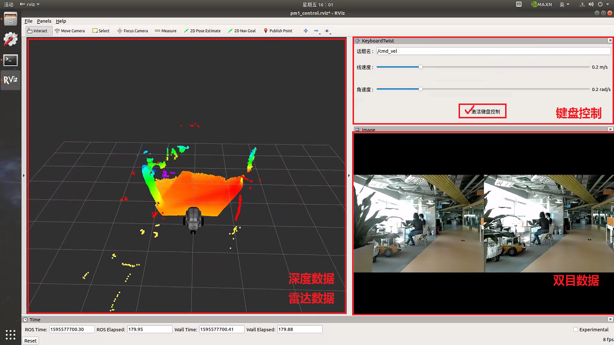

# 远程控制

点击桌面 【远程控制】 图标

弹出 RVIZ 与 terminal，RVIZ 中 有 雷达数据、图像数据 与 键盘控制工具。

操作步骤：

1. 确认 PM1 的急停没有按下，PM1 周围有充足的可运动空间
2. 在 RVIZ 中勾选【激活键盘控制】，使用键盘控制机器人运动
3. 使用完毕，取消勾选【激活键盘控制】
4. 点击 terminal 界面，键盘按键 ctrl+c 关闭应用

说明：

1. 雷达数据中，一个网格为 1m ，通过 红色（前雷达） 黄色（后雷达）激光点 距离机器人 base_link 坐标系的距离，可判断机器人周围障碍物的情况
2. **远距离** 遥控请选择 **外网** 连接

