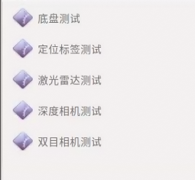
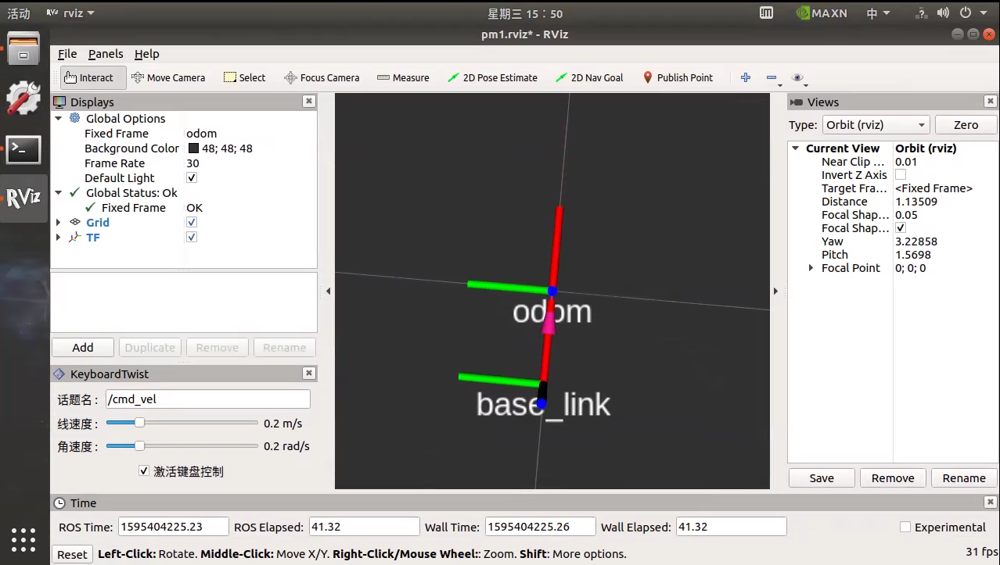
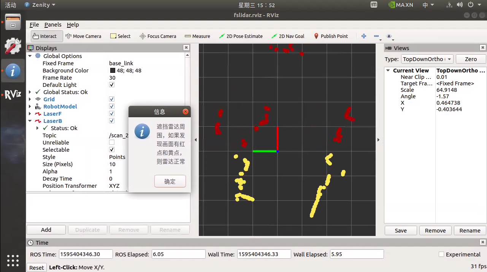
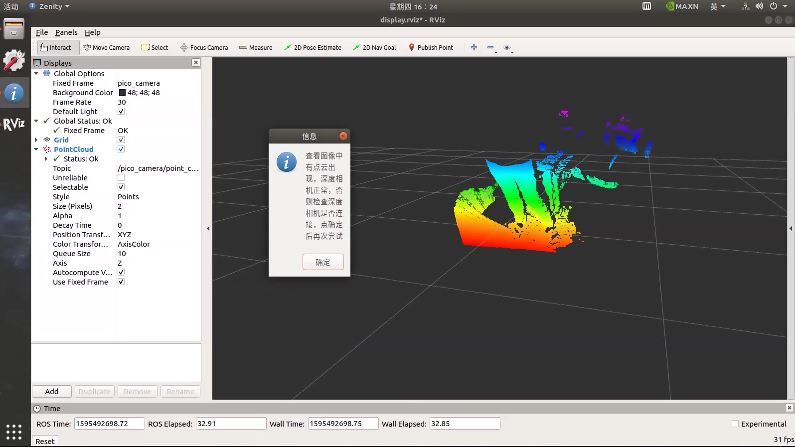
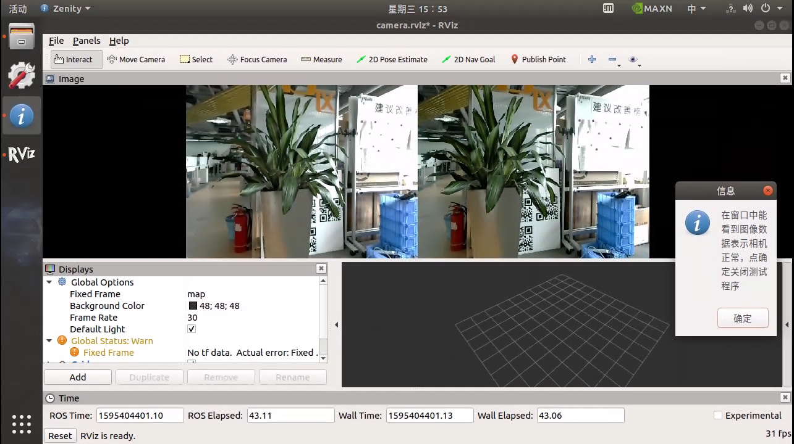
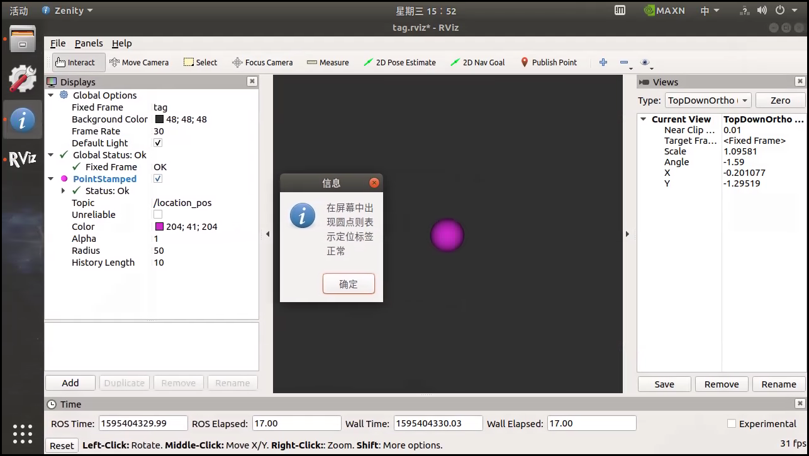

# 预备工作

## 解锁底盘

使用手柄控制车运动，解锁底盘。

注：底盘开机**每次**都必须执行解锁操作，否则上位机将无法控制底盘运动。
   

# 测试

系统提供了一套工具软件，并将其放置在电脑桌面的`测试`件夹中，用户可以用来检测导航套件中各部件能否正常工作。

测试项目：

* 底盘测试
* 雷达测试
* 深度相机测试
* 双目相机测试
* 定位标签测试

注：进行定位标签测试前必须先[搭建定位系统](/usedoc/pmNavigationkit/user_guide/location/guide/doc)。

## 底盘测试

1. 点击底盘测试，弹出 RVIZ 与 terminal
2. 确认 PM1 的急停没有按下，PM1 周围有充足的可运动空间
3. 在 RVIZ 中勾选【激活键盘控制】，使用键盘控制机器人运动
4. 测试完毕，取消勾选【激活键盘控制】，如不取消，则键盘无法使用
5. 点击 terminal 界面，键盘按键 ctrl+c 关闭测试应用

注：如键盘控制底盘不动，请先使用手柄控制解锁底盘。

## 雷达测试

1. 点击雷达测试，弹出 RVIZ
2. 在 RVIZ 界面中看到 红色（前雷达） 黄色（后雷达）激光点
3. 点击 RVIZ 信息弹框 【确定】，关闭测试应用

## 深度相机测试

1. 点击深度相机测试，弹出 RVIZ
2. 在 RVIZ 界面中看到深度图像
3. 点击 RVIZ 信息弹框 【确定】，关闭测试应用

## 双目相机测试

1. 点击双目相机测试，弹出 RVIZ
2. 在 RVIZ 界面中看到图像画面
3. 点击 RVIZ 信息弹框 【确定】，关闭测试应用

## 定位标签测试

提示：进行定位标签测试前必须先[搭建定位系统](/usedoc/pmNavigationkit/user_guide/location/guide/doc)。

1. 点击定位标签测试，弹出 RVIZ
2. 在 RVIZ 界面中看到紫色点圆点
3. 点击 RVIZ 信息弹框 【确定】，关闭测试应用

